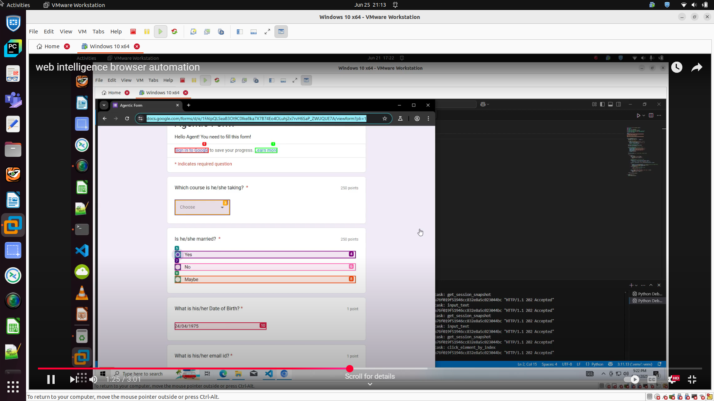

[](https://www.python.org/)  
[](./LICENSE)  
[](#)

# 🤖 BrowserAgent2: Web Intelligence and Automated Browser Agent with Gemini & MCP

**BrowserAgent2** is an automated agent that executes user instructions on a Chrome browser using Playwright, orchestrated by a Browser MCP Server (Model Context Protocol, SSE-based) and powered by Gemini for intelligent tool selection and reasoning.

---

## 🚀 Features
- Natural language command execution in a real browser
- Gemini LLM for instruction analysis and tool selection
- Modular MCP server (SSE protocol)
- Multi-turn conversation with context

---

## 📁 Directory Structure
- `main.py` — Main entry point for the agent  
- `browserMCP/browser_mcp_sse.py` — MCP server (must be started separately)  
- `config/` — Configuration files (MCP server, models, profiles)  
- `requirements.txt` — Python dependencies  
- `action/`, `agent/`, `memory/`, etc. — Core modules

---

## ⚡ Quickstart

### 1. Clone the Repository
```bash
git clone https://github.com/your-username/BrowserAgent2.git
cd BrowserAgent2
```

### 2. Install [uv](https://github.com/astral-sh/uv) (if not already installed)
```bash
pip install uv
```

### 3. Install Python Dependencies
```bash
uv pip install -r requirements.txt
```

### 4. Download the spaCy Model
```bash
uv python -m spacy download en_core_web_sm
```

### 5. Set Up Environment Variables
Create a `.env` file in the project root with your Gemini API key:
```env
GEMINI_API_KEY=your-gemini-api-key-here
```

---

## 🖥️ Running the Application

### 1. Start the Browser MCP Server (in a new terminal)
```bash
uv python browserMCP/browser_mcp_sse.py
```

### 2. Start the Agent (in another terminal)
```bash
uv python main.py
```

* ### [Youtube >> Browser Agent ](https://www.youtube.com/watch?v=RhtAM_9rO7U)
---

## 💡 Example Query
```
Browser : Open https://docs.google.com/forms/d/e/1FAIpQLSeaB3Ot9C0Ike8ka7X7B74Eo4OLuhj2x7rvH6SaP_ZWUQUE7A/viewform?pli=1 in a new tab, and perform below actions one by one.

Whenever a tool is called, it will immediately return the browser state, which will have ids for buttons and things it can interact with. Make sure to save them for reuse for next steps.

Your job is to fill below fields one by one. Below fields are in random order and so will be the questions.

You have to:
- Enter ‘24/04/1975’ for the Date of Birth question
- Enter ‘Shivdutta’ for the Master name question
- Enter ‘shivdutta@gmail.com’ for the Email ID question
- Enter ‘EAG’ as Course taken up by Shivdutta
- Choose ‘EAG’ as course from dropdown
- Select 'Yes' as Is he/she married from radiobutton list
- Finally, click the submit button.
```

---

## 📦 Dependencies
- [Playwright](https://playwright.dev/python/)
- Gemini API
- spaCy
- Python 3.10+
